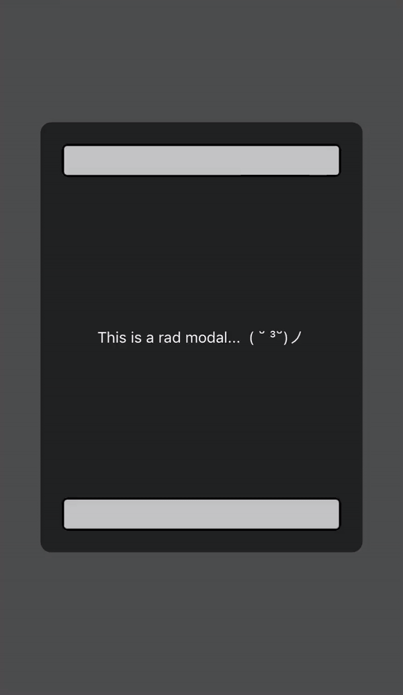

# rn-keyboard-avoider

A keyboard-avoiding view for Android and iOS in React Native with Expo.

Pushes `TextInput` fields gracefully above the top of the keyboard, with a customisable offset between the `TextInput` and the keyboard.



## Installation
```bash
npm install rn-keyboard-avoider
```

For proper behaviour on Android devices, add the `softwareKeyboardLayoutMode` property to your ***app.json*** file as follows:

```json
{
  "expo": {
    "android": {
      "softwareKeyboardLayoutMode": "pan"
    }
  }
}
```

## How to Use

Simply wrap your app with the component:

```jsx
import { KeyboardAvoider } from 'rn-keyboard-avoider';

export default function App() {
  <KeyboardAvoider>
    {/* your app contents */}
  </KeyboardAvoider>
);
```

For proper behaviour on Android devices in landscape orientation, add the `disableFullscreenUI` property to your `TextInput` components as follows:

```jsx
<TextInput disableFullscreenUI={true}/>
```

## Properties

### yOffset (optional): number
Controls the distance between the top of the keyboard and the bottom of your `TextInput` field. Default is 10px.


## Known Issues

- On Android devices, unfortunately, the yOffset will be lost once the user starts typing. This is due to the behaviour of the native `softwareKeyboardLayoutMode` property being set to `pan`. If an offset is absolutely needed, increase the padding of your TextInputs.

## About

Made by <span style="color:#cc5f0a;font-weight:bold">friggitydingo</span> to support the development of a mobile sci-fi MMO built with React Native.

[](http://discord.gg/qRMMvxW3yc)

[](https://twitter.com/BenScottSteer)
